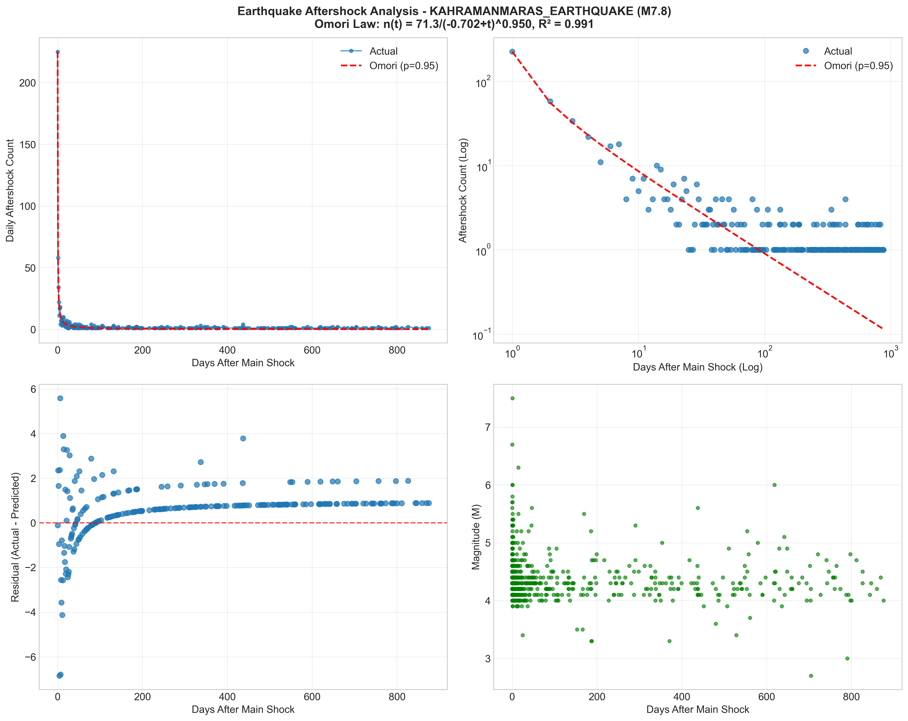
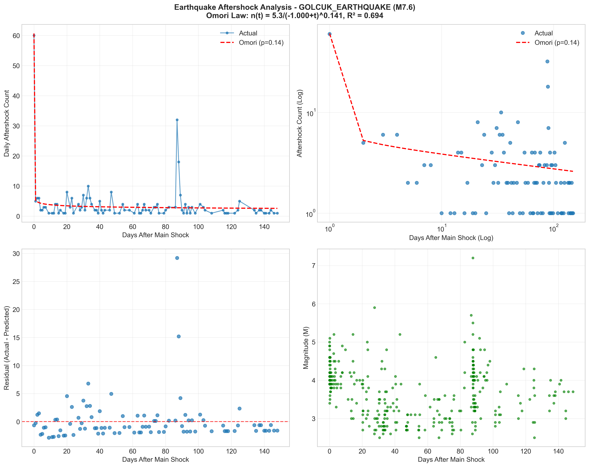
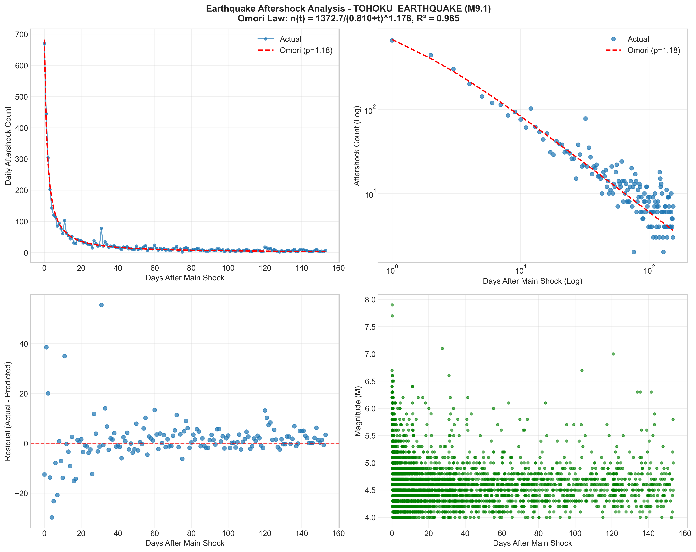
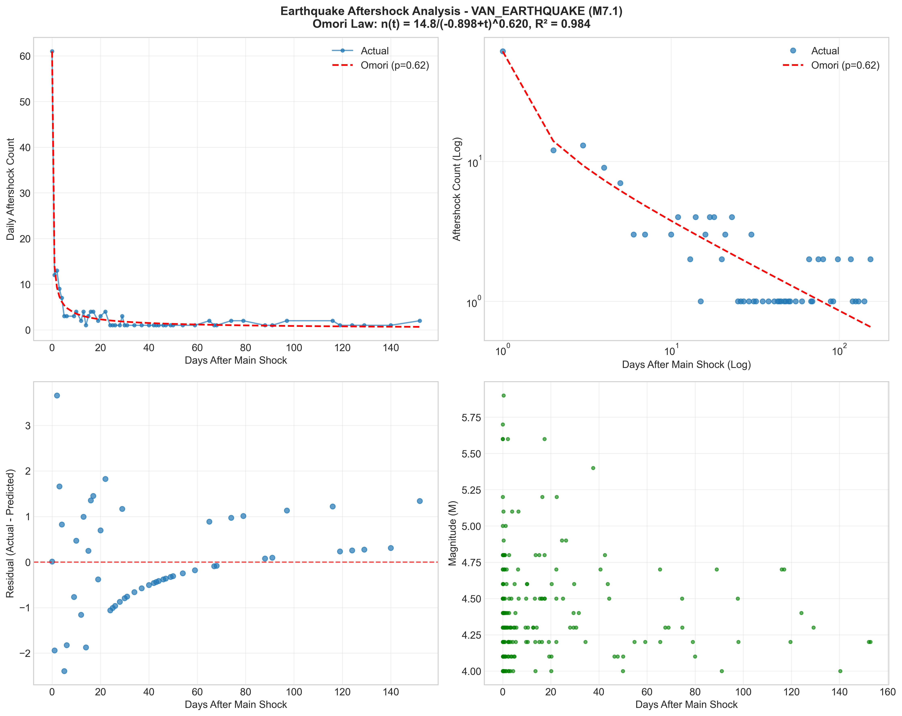
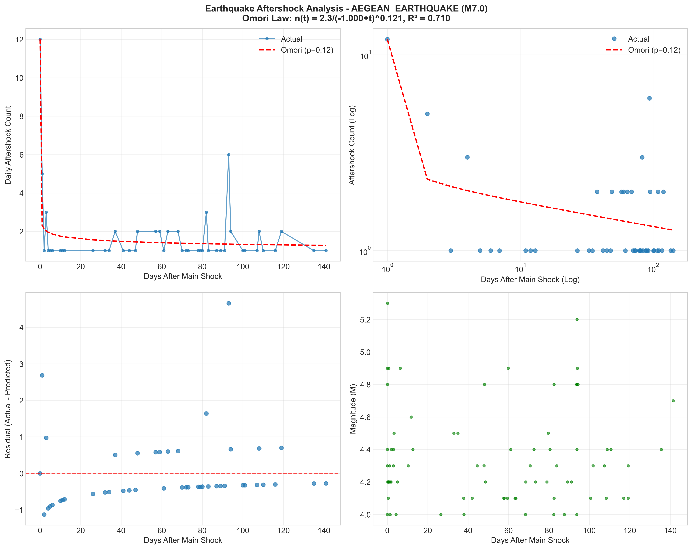

# Earthquake Aftershock Analysis

Python application for analyzing earthquake aftershocks using Omori's Law and real data.

## Table of Contents
- [Features](#features)
- [Usage](#usage)
- [Data Format](#data-format)
- [Results](#results)
- [License](#license)
- [More Details](#more-details)

  
## Features
- Comparison of actual earthquake data with scientific data.
- Omori's Law parameter fitting.
- Multiple visualization types.
- Statistical analysis and metrics.
- Support for various earthquake datasets.

## Usage
The current project directory contains data source files for 5 different earthquakes in .csv format. These earthquakes are:


- 1999 Gölcük Earthquake, Turkey (M7.6)

- 2011 Tōhoku Earthquake, Japan (M9.1)

- 2011 Van Earthquake, Turkey (M7.1)

- 2020 Aegean Earthquake, Turkey (M7.0)

- 2023 Kahramanmaraş Earthquake, Turkey (M7.8)


The source code supports any 5-month earthquake catalog .csv file provided by the [USGS (United States Geological Survey)](https://earthquake.usgs.gov/earthquakes/search/). To analyze, simply add the required file (.csv) to the directory and name it accordingly.

## Data Format

The application requires earthquake data in CSV format with the following columns:

- time: Timestamp of the earthquake (ISO 8601 format: YYYY-MM-DDTHH:MM:SS.sssZ)
- latitude: Geographic latitude in decimal degrees.
- longitude: Geographic longitude in decimal degrees
- depth: Depth of the earthquake in kilometers
- mag: Magnitude of the earthquake
- place: Description of the earthquake location

For example first line of aegean_earthquake.csv file:
- time: 2020-10-30T09:20:36.917Z,
- latitude: 34.4019,
- longitude: 26.4286,
- depth: 10,
- mag: 4.6,
- place: "89 km S of Palekastro, Greece",

Other data such as data source, data status, etc. are available between the lines, but the data types given above are the most important ones.    

## Results

### 2023 Kahramanmaraş Earthquake (M7.8)


### 1999 Gölcük Earthquake (M7.6)


### 2011 Tōhoku Earthquake (M9.1)


### 2011 Van Earthquake (M7.1)


### 2020 Aegean Earthquake (M7.0)


### Prerequisites
- Python 3.9+, 3.11 suggested.
- pip package manager.

### Install Dependencies
```bash
git clone https://github.com/tturkayy/earthquake-aftershock-analysis.git
cd earthquake-aftershock-analysis
pip install -r requirements.txt
```

## License
This project is licensed under the MIT License - see the [LICENSE](LICENSE) file for details.

## More Details
For more details, you can check out [my article about this project on Medium](https://turkayyildirim.medium.com/earthquake-aftershock-analysis-with-python-omoris-law-application-8227d6407e89).
